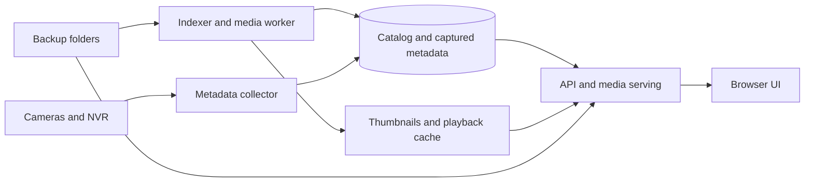

**ReoUI — Docker-hosted Reolink video archive**

Build a local web application that makes an existing video archive searchable by camera, time, and event. Perform media inspection, metadata enrichment, thumbnail creation, and playback preparation in background workers. The UI should query an indexed catalog and serve prepared media without waiting for cameras or filesystem scans.

This is the implementation plan. An initial working version is now running in Docker; see [README.md](README.md) for the implemented features, setup, and remaining limits. The workspace was empty at the start. Research date: 19 September 2026. The upstream revision inspected was `7d8d503403076b9b92599b8bc0de92f62b712364`.

**1. Working assumptions and scope**

- Confirmed source: an existing backup folder, with camera/NVR access available for metadata enrichment. Importing existing files is the first release's core workflow.
- Include device metadata collection in the planned deployment. Playback and indexing remain independent of device availability, including after recordings expire on-device.
- Confirmed scale: support at least three cameras, with five cameras as the primary optimization and acceptance target, and approximately 4 TB of retained original recordings. Keep camera count configurable rather than imposing a five-camera limit.
- Assume one Docker host and a small number of simultaneous viewers until the deployment hardware is specified. Measure actual file count and recorded hours; 4 TB alone does not determine either. Use one million catalog entries as an additional stress test, not an estimate of this archive's size.
- Keep originals immutable. Store catalog data, captured metadata, generated media, and exports separately.
- Plan a responsive desktop/mobile UI. Desktop provides the full timeline; mobile emphasizes finding and watching events.
- Automatic downloading from cameras/NVRs is an optional later ingestion module. It is independent of browsing existing backups.

Before implementation, confirm the backup method and filename layout, device models/firmware, retained hours and file count, Docker hardware, available storage beyond the 4 TB archive, and primary browsers. The Docker host type, CPU, RAM, and hardware-encoding support are still unspecified. These inputs affect tuning rather than the basic architecture.

**2. Metadata coverage and its limits**

The library provides recording searches through `request_vod_files()`, downloads, device/channel information, capability checks, and state accessors. Recording results can be incomplete, so use actual file inspection for media properties. Treat device settings as observations at collection time, rather than historical facts about an older video. [Host API source](https://github.com/starkillerOG/reolink_aio/blob/7d8d503403076b9b92599b8bc0de92f62b712364/reolink_aio/api.py).

Recording objects expose times, filenames, sizes, stream types, and trigger flags. Recognized filenames can recover some triggers offline. The trigger vocabulary includes scheduled recording, motion, person, vehicle, animal, doorbell, package, face, I/O, crying, line crossing, intrusion, lingering, forgotten items, and taken items. Availability varies by model, firmware, and recording format; an enum member does not establish device support. [Recording types and filename parser](https://github.com/starkillerOG/reolink_aio/blob/7d8d503403076b9b92599b8bc0de92f62b712364/reolink_aio/typings.py).

Baichuan recording searches can expose historical event intervals on supported devices. Its state accessors also expose smart-rule locations, tamper state, I/O, and detailed detection subtypes. Detailed classifications include vehicle types, animal types, bicycles, and device-reported person categories. These are reported labels, not verified identities or attributes. Do not promise historical bounding boxes, confidence scores, object tracks, or recognition identities without demonstrating that a supported source actually returns them. [Baichuan implementation](https://github.com/starkillerOG/reolink_aio/blob/7d8d503403076b9b92599b8bc0de92f62b712364/reolink_aio/baichuan/baichuan.py), [classification definitions](https://github.com/starkillerOG/reolink_aio/blob/7d8d503403076b9b92599b8bc0de92f62b712364/reolink_aio/const.py).

Implement the following collection policy:

| Metadata group | Proposed stored information | Collection and presentation |
| --- | --- | --- |
| Archive identity | Source root, relative path, original name, size, modification time, import time, content fingerprint, availability | Always collect; filesystem time is not automatically recording time. |
| Media facts | Container, video/audio codecs, dimensions, frame rate, duration, bitrate, timestamps, rotation, stream count, probe/decode problems | Inspect the backup itself; retain the probe result. |
| Recording context | Camera/channel/lens/stream association, recording start/end, device recording identifier, trigger labels | Reconcile filenames, sidecars, and device recording searches; retain conflicting observations. |
| Event intervals | Event kind, start/end when available, recording association, rule/location, subtype, timing precision | Separate a recording-wide trigger from a timed event. Preserve multiple event kinds. |
| Device identity | Stable device/channel identity, names, model, hardware and firmware, capabilities | Keep a history so camera replacements and renames remain understandable. |
| Configuration context | Exposed encoding, recording, detection, image, audio, lighting, PTZ, privacy, notification, and rule settings | Snapshot supported read-only information; deduplicate unchanged snapshots. |
| Operational context | Exposed online/sleep, battery, Wi-Fi, storage, and other device states | Store time-stamped observations, with staleness and collection gaps. |
| User metadata | Bookmarks, notes, review state, tags | Persist independently of generated assets. |
| Derived assets | Posters, scrub sprites, playback variants, processing versions and status | Regenerable, quota-managed cache. |

Use a versioned collector registry: each supported read-only metadata surface has a capability prerequisite, collection frequency, serializer, freshness rule, and coverage test. Inventory all public read-only surfaces in the pinned library during the first milestone. Track unimplemented, unsupported, unavailable, and successfully collected fields separately. Include an advanced metadata drawer with source values and coverage details so less common fields remain accessible without crowding the main screen.

Preserve exposed structured source data alongside normalized fields, after removing credentials and tokens. Public event callbacks may expose updated state rather than the original wire message: store the observations actually available and do not depend on private internals to promise complete raw protocol capture.

Every observation needs its source, collection timestamp, applicable time or interval, device/library version, and precision. Use `unknown` when data is absent; a default false value or an empty trigger mask must not automatically become “no motion.” Current battery level or settings must never be silently attached to old clips as if captured with them.

Existing videos cannot recover metadata that was never preserved and is no longer available on the source device. Start metadata capture early, archive it durably, and support importing/exporting metadata manifests alongside video backups.

**3. User experience**

The primary task should take three steps: choose cameras and a date, narrow by event, then select a result or point on the timeline.

| View | Main behavior |
| --- | --- |
| Timeline, default desktop view | Camera selector; calendar with recording coverage; zoomable day/hour/minute timeline; event markers; clear gaps; large player; related event cards. |
| Events | Thumbnail cards with camera, time, duration, and event chips; filters for event type and camera; touch/hover scrub previews; efficient scrolling. |
| Recording detail | Player with adjacent recordings, speed and skip controls, original/compatible quality selection, bookmark/note, download, and expandable metadata. |
| Library status | Indexed versus pending files, enrichment coverage, device connectivity, source availability, cache usage, failed jobs, and retry controls. |
| Setup | Add backup roots, set camera timezone, map folders to cameras, optionally connect devices, and choose cache budget. |

Show common filters immediately; reveal advanced metadata filters when the archive actually contains those fields. Represent “unknown event metadata” explicitly so older clips remain discoverable. Keep the selected camera, time, and filters in the URL and retain them when returning from playback.

Render coverage and event density at the current zoom level. Do not send every recording to the browser to draw a day overview. Differentiate recording-wide event labels from interval markers; “next event” must not claim an exact seek location when only a file-level label exists.

Include keyboard playback controls, accessible focus states, non-color-only event indicators, touch-friendly scrubbing, and reduced-motion support. Load thumbnails for visible results only. Keep video elements out of off-screen result cards. Add synchronized multi-camera playback after the single-camera flow is reliable; display missing footage explicitly and cap concurrent decoders.

**4. Recommended architecture**

Use Python/FastAPI with a thin `reolink_aio` adapter, React/TypeScript for the frontend, FFmpeg/ffprobe for media work, and SQLite in WAL mode for the first deployment. This keeps the Python integration direct and the operational footprint small. FastAPI documents building an application-specific Docker image. [FastAPI container guidance](https://fastapi.tiangolo.com/deployment/docker/).

Deploy two Compose services from the same application image:

- `app`: API, built frontend, authentication, and efficient HTTP media delivery.
- `worker`: scanning, metadata collection, durable job scheduling, and bounded FFmpeg subprocesses. Keep event subscriptions responsive in a separate asynchronous task; CPU work must not block it.

Use a database-backed queue with atomic job claims, leases, heartbeat, retry/backoff, and unique job keys. Keep writes short and batch catalog updates. Begin with one worker coordinator and one expensive media subprocess; increase concurrency only after benchmarking the actual host with five cameras ingesting. Limit historical metadata searches per device so multiple channels on one NVR share its request budget. Use migrations and a repository layer so PostgreSQL can replace SQLite if measured writer contention or multi-host operation requires it.

Volumes:

| Container path | Purpose | Access |
| --- | --- | --- |
| `/recordings/<source>` | Existing local/NAS archives | Read-only in both services |
| `/data` | Database, durable metadata, user notes, collector checkpoints | Read/write on storage local to the Docker host |
| `/cache` | Generated thumbnails, playback derivatives, temporary processing | Worker read/write; app read-only where practical |
| `/exports` | Requested clip and metadata exports | Controlled read/write |
| `/run/secrets` | Device credentials and application secrets | Read-only secret mounts |

Keep SQLite on a local filesystem, even when the media archive is on SMB/NFS: WAL does not support a network filesystem and permits only one writer at a time. [SQLite WAL documentation](https://sqlite.org/wal.html).

Build Linux amd64 and arm64 images. Offer an optional host-specific hardware-acceleration profile after validating FFmpeg support on that host; retain a CPU path. Configure restart policies, health checks, UID/GID, resource limits, graceful shutdown, and schema migration backups. Use Compose secrets for credentials. [Docker Compose secrets](https://docs.docker.com/compose/how-tos/use-secrets/).

Protect the UI, originals, thumbnails, and exports with the same authentication. Serve media by catalog ID, validate paths against configured roots, support HTTP range requests, and keep device URLs/credentials server-side. Use an existing reverse proxy for HTTPS when needed. Collection should use read operations; check library helpers for incidental setting changes before adopting them.

**5. Indexing and preparation pipeline**

Make each stage independently resumable and idempotent. A new file can become searchable before all of its previews are ready.

1. **Discover and stabilize.** Run an initial scan, incremental scans, and periodic reconciliation. Use filesystem notifications as an optimization; polling remains necessary for network shares. Ignore temporary downloads; prefer an atomic completion signal from the backup producer, otherwise require a configurable stability interval. Recheck file identity/size after processing to catch resumed uploads.
2. **Register.** Assign a stable asset ID. Use source/path/size/mtime for cheap change detection and sampled fingerprints for candidate duplicates. Only a full content hash establishes byte identity; calculate it when needed or in the background. Preserve aliases for copies and moves.
3. **Probe.** Run bounded `ffprobe` jobs and save structured format/stream data. Record failures without stopping the scan. Probe success is not a guarantee that every frame decodes; offer deeper validation separately. [ffprobe documentation](https://ffmpeg.org/ffprobe.html).
4. **Resolve identity and time.** Apply explicit folder/camera mappings, sidecars, and recognized filename parsers. Store raw timestamps, camera timezone/DST context, normalized UTC, and timestamp confidence. Do not silently use file modification time for renamed files. Handle midnight boundaries, repeated DST hours, channel reassignment, and clock drift.
5. **Publish basic catalog entries.** Commit in small batches and notify the UI of progress. Newest files and the user's current selection get preview priority. Unchanged files skip completed stages.
6. **Enrich.** Match device records using device/channel/lens/stream, time overlap, source identifiers, and compatible durations. Allow several files to cover one recording and several events to overlap one file. Store association confidence and require review for ambiguous matches. One time-and-size heuristic must not silently overwrite established metadata.
7. **Prepare posters and scrub previews.** Generate a representative poster plus tiled JPEG/WebP sprite sheets and a timestamp map. Start with roughly 5–10-second sampling for short event clips and 30–60 seconds for long continuous recordings; adapt to duration and impose an output cap. Prefer frames around known events, with a deterministic fallback. Sprite previews must render without seeking/decoding the source video in the browser.
8. **Prepare playback.** Select direct playback, remux, audio conversion, or a compatible video proxy using the policy below. Write derivatives to temporary files and atomically publish only validated outputs.
9. **Aggregate.** Incrementally update per-camera coverage intervals, event counts, and timeline bins at several resolutions. Keep clip counts and event counts distinct. Invalidate only affected time ranges.

Persist stage, progress, last error, attempt count, input fingerprint, and processing profile version. Allow retry/cancel/rebuild. Apply CPU, memory, I/O, and disk limits; reserve free space and pause processing before a full disk. Expensive tasks should yield capacity to playback.

On a failed or missing NAS mount, mark the source unavailable rather than treating the entire archive as deleted. Reconcile actual missing files only after a successful scan. Preserve notes and captured metadata when media disappears; remove generated assets through a separate garbage-collection policy.

**6. Playback policy and storage tradeoffs**

H.265 support varies by browser/platform, so container extension alone cannot select a playback path. Feature-detect and validate supported codec profiles, with a prepared H.264 fallback for the target browser matrix. [Browser codec guidance](https://developer.mozilla.org/en-US/docs/Web/Media/Guides/Formats/Video_codecs).

| Input/need | Preparation policy |
| --- | --- |
| Browser-compatible MP4 with acceptable seeking | Serve the original through authenticated range requests. |
| Compatible video with inconvenient container/layout | Create a stream-copy MP4 derivative; move MP4 metadata to the beginning when appropriate. |
| Compatible video, incompatible audio | Copy the video and convert audio to a supported format. |
| Incompatible or expensive video | Generate a configurable 720p/1080p H.264 playback proxy, preserving aspect ratio and audio when present. |
| Long recordings or extended timeline sessions | Add HLS/fMP4 packaging when measurements justify it; this is not required for the initial clip player. |

MP4 `faststart` relocates container metadata; it does not change the video codec or create more frequent keyframes. Proxy encoding should use a seek-friendly keyframe interval, initially around two seconds. Segmented playback also needs suitable keyframe boundaries. [FFmpeg format and segmentation documentation](https://ffmpeg.org/ffmpeg-formats.html).

Default preparation policy: create metadata, posters, and bounded scrub previews for the whole archive; prepare compatible proxies for new/recent incompatible recordings and user-selected files first; backfill older proxies within the configured cache budget. Offer a “prepare entire archive” mode when storage and compute allow it. Explain the first-play preparation delay for uncached older recordings.

Prefer an existing matching substream as a lightweight playback variant when its time alignment and quality are acceptable. A substream and main stream are distinct assets, not duplicate files. Preserve the mapping between recording time and media presentation time across every derivative.

Set a cache quota with separate priority for small previews and large proxies; evict regenerable, least-recently-used proxies first and protect in-use assets. Never place captured device metadata or notes in the evictable cache. Back up those durable records because rebuilding from video alone may lose them.

For capacity planning, a continuous 1 Mbit/s proxy requires approximately 10.8 GB per camera per day, excluding audio and overhead. Five cameras over 30 days would require about 1.62 TB of proxy storage. Measure real samples before choosing full-archive transcoding. Report estimated derivative storage and processing throughput during setup.

Treat the confirmed 4 TB as original recordings, with durable application data and derivative storage budgeted separately. Use 200 GB as a provisional configurable cache budget if the host has sufficient additional space; it is a planning value, not a measured requirement. At the example bitrate, 200 GB holds at most about 3.7 days of continuous proxies across five cameras before accounting for audio, previews, and overhead. Prioritize small scrub previews and recent/requested proxies, and tune the quota from sample measurements. Do not infer unused capacity from the archive size or reserve space by deleting originals.

For the initial 4 TB import, populate the basic catalog first and expose per-stage progress while preview preparation continues. Avoid full-file hashing and full transcoding as prerequisites for visibility. Estimate completion time from measured scanning, probing, and decoding throughput rather than total bytes alone.

**7. Device enrichment and ongoing capture**

Discover channels and capabilities once connected. Maintain explicit identities for physical cameras, NVR endpoints, channels, and extra lenses. Persist mappings with effective dates so replacing a camera does not relabel old footage.

Backfill recording metadata in bounded time windows, with overlap and persistent checkpoints. Prioritize the oldest still-retrievable device history before retention erases it; this runs independently of newest-first media preparation. Detect incomplete/saturated result windows and subdivide them rather than assuming a successful response is exhaustive. Revisit recent windows for late-finalized recordings.

Use a version-pinned adapter for standard recording results and, where validated, historical trigger intervals. Keep event-search placeholder values separate from actual file size/duration. Test the device's timestamp interpretation against known recordings before joining intervals to backups.

The library supports ONVIF subscriptions and Baichuan TCP event callbacks. Prefer a supported transport that works with the Docker network; ONVIF push callbacks require a reachable callback address. [Upstream subscription examples](https://github.com/starkillerOG/reolink_aio#usage).

Persist observed state transitions, device timestamps when exposed, server receipt time, disconnects, and collection gaps. Refresh context on changes or at a conservative cadence; deduplicate snapshots and avoid aggressively waking battery devices. Reconnect with backoff, renew subscriptions where required, and backfill recoverable history after outages. Never turn a collection gap into a claim that nothing happened.

An optional download module can later use the library's VOD download support. It needs its own writable destination, per-device concurrency limits, temporary files, validation, retry/checkpoint behavior, and sidecar manifests. Completion then feeds the same indexing pipeline. Streaming download support alone should not be assumed to provide byte-range resume on every device.

**8. Data model and query design**

| Entity | Responsibility |
| --- | --- |
| `sources` | Roots, mount availability, scanning policy and checkpoints |
| `devices`, `cameras`, `channel_mappings` | Stable identities, channels/lenses, effective mapping dates |
| `recordings` | Logical capture intervals and source recording identifiers |
| `assets` | Actual files, paths/aliases, media facts, fingerprints and availability |
| `recording_assets` | Stream variants and partial/merged file coverage |
| `events`, `event_recordings` | Observed or historical intervals, kinds, provenance, associations |
| `metadata_observations`, `device_snapshots` | Normalized/exposed data, timestamps, precision, freshness, versions |
| `derivatives` | Asset/profile version, time mapping, cache path, readiness and size |
| `jobs`, `collector_checkpoints` | Durable work and recoverable synchronization |
| `coverage_bins`, `event_bins` | Bounded timeline overview queries |
| `bookmarks`, `notes`, `tags` | User-owned archive organization |

Index camera/time and event-kind/time queries, association foreign keys, source/path lookup, and job status. Use keyset pagination with a stable timestamp-plus-ID ordering. Resolve requested timeline time to an available asset and media offset; make gaps explicit. Use full-text indexing for notes and names if needed, without introducing an external search service initially.

Suggested API resources: sources, cameras, recording search, event search, coverage/timeline bins, recording detail, playback variants, authenticated media, bookmarks, exports, and processing status. Send progress changes through server-sent events. Give generated assets versioned URLs and private caching rules appropriate for authenticated footage.

**9. Delivery sequence**

| Milestone | Deliverable | Exit condition |
| --- | --- | --- |
| 1 — Validate inputs and metadata | Representative clips; device capability report; pinned integration adapter; metadata coverage inventory; media cost measurements | Correct camera/time associations demonstrated, supported historical/live metadata identified, and playback paths verified on target browsers. |
| 2 — Archive browser | Compose deployment; migrations; resumable scanner; probe; camera mapping; posters; event-list shell; range playback and compatible proxy path | Browse and play a representative existing archive with devices disconnected. Original files remain untouched. |
| 3 — Enrichment and preservation | Device backfill; filename trigger parsing; event capture; time/provenance handling; durable metadata backup/export | Metadata survives device retention and restarts; unknown/unsupported states and collection gaps display correctly. |
| 4 — Fast timeline UX | Scrub sprites; zoomed coverage bins; event filters; adjacent playback; keyboard/mobile flows; bookmarks and notes | Find and play an event quickly while indexing continues, with bounded browser memory. |
| 5 — Reliability and release | Cache quotas; failure recovery; authentication; migration/restore checks; hardware profiles; multi-architecture images; operator docs | Meets the acceptance checks below on the selected deployment hardware. |
| Later extensions | Synchronized multi-camera playback; clip trimming/export; automatic device backups; optional independent video analysis | Separate acceptance criteria and measured resource budgets for each extension. |

Start durable metadata capture as soon as milestone 1 confirms access, even while the browser is being built. Otherwise useful device history may expire during development.

Planning allowance: approximately 4–6 engineering weeks for one experienced developer to deliver the first reliable release, subject to actual device quirks and media samples. This is a scope estimate, not a commitment; extensive hardware compatibility or automatic backups should be estimated separately.

**10. Acceptance and performance checks**

The primary acceptance scenario is five configured cameras, approximately 4 TB of retained originals, one viewer, and active background indexing and metadata collection. Also verify the three-camera minimum. Use the measured archive file count and duration distribution, with a separate synthetic catalog test up to one million entries.

A four-core host with 8 GB RAM, local SSD for database/cache, and gigabit LAN is a provisional benchmark baseline; the user's Docker hardware is still unknown. Measure on the actual host before accepting the targets below or increasing media-processing concurrency.

| Operation | Initial target |
| --- | --- |
| Indexed camera/event search | p95 API response below 200 ms with warm database cache |
| Typical day timeline | p95 API response below 300 ms with bounded bins |
| First usable archive screen | Below 2 seconds on LAN after application assets are cached |
| Playback start for a ready derivative | p95 below 1 second |
| Seek in a ready compatible proxy | p95 below 500 ms on LAN |
| Scrub preview | Below 100 ms once its sprite has loaded; no video decode required |
| New finalized recording | Searchable within 60 seconds at steady state; playback preparation tracked separately |

Report cold-cache, network-share, initial-import, and uncached-proxy performance separately. Measure processing throughput against incoming recorded hours, queue age, cache growth, CPU use, and p95 UI latency. Ongoing processing capacity must exceed incoming work, or the UI must expose the backlog and let the operator adjust policy.

Verification should cover H.264/H.265, incompatible audio, no audio, main/substream pairs, long GOPs, variable frame rates, renamed files, overnight recordings, DST ambiguity, device clock drift, partially copied/corrupt files, overlapping events, camera replacement, metadata conflicts, and missing device history. Use recorded API fixtures for reproducibility and a small real-device smoke test for firmware behavior.

Exercise restart during each indexing stage, mount disappearance, network reconnection, cache exhaustion, duplicate imports, and database migration/restore. Confirm authorization on media and previews, path traversal resistance, secret redaction, browser playback on the selected desktop/mobile matrix, and keyboard accessibility. Verify source immutability through read-only mounts and representative before/after hashes.

The first implementation step is milestone 1: establish a representative sample corpus and capture a device capability/metadata report. That makes the codec policy, collector coverage, timestamp matching, and resource budget concrete before building the full UI.
