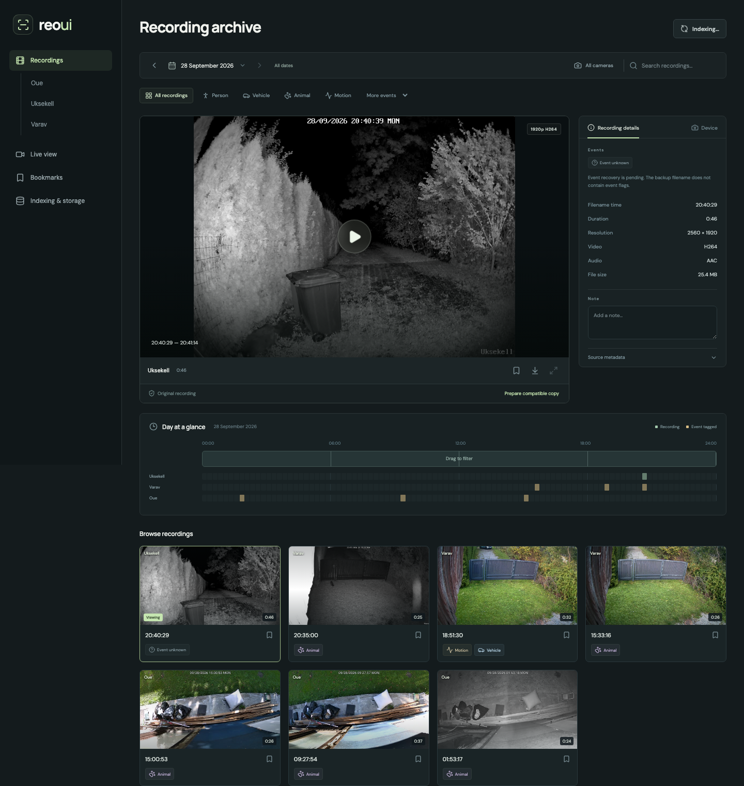
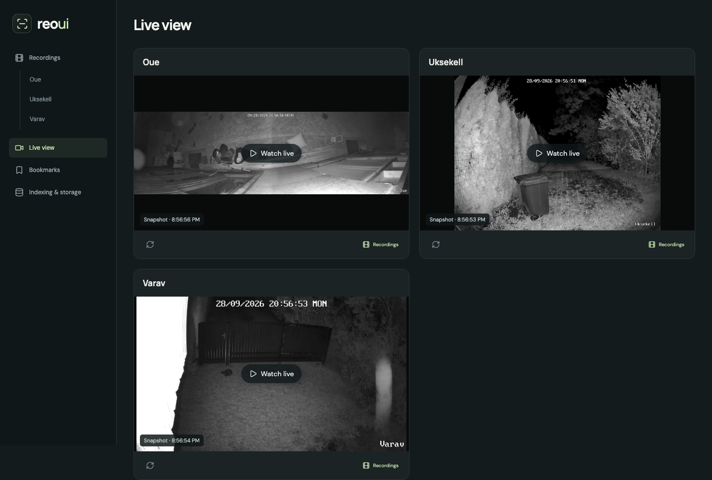

# ReoUI

[](https://github.com/v3rm0n/reoui/actions/workflows/docker-publish.yml)
[](LICENSE)

ReoUI is a web interface for browsing recordings in an existing Reolink backup directory.

## Screenshots

### Recordings



### Live view



## Quick start

You need Docker Compose and an existing backup directory. Camera access is optional; live streams require an enabled H.264 RTSP substream.

```sh
git clone https://github.com/v3rm0n/reoui.git
cd reoui
mkdir -p .local/data .local/cache .secrets
chmod 700 .secrets
cp .env.example .env
cp cameras.example.json .secrets/cameras.json
chmod 600 .secrets/cameras.json
```

Edit `.env`:

```dotenv
REOUI_ARCHIVE=/absolute/path/to/reolink-backups
REOUI_UID=1000
REOUI_GID=1000
REOUI_TIMEZONE=Europe/Tallinn
```

Use your host user's numeric IDs from `id -u` and `id -g`. Set the timezone used by your camera filenames. Keep data and cache directories outside the archive.

To connect a camera, edit `.secrets/cameras.json`:

```json
{
  "cameras": [
    {
      "host": "192.0.2.10",
      "username": "admin",
      "password": "your-camera-password",
      "folder": "garden"
    }
  ]
}
```

`folder` is the top-level camera folder inside the backup directory. For archive-only use, set `{"cameras": []}`. You can connect unmapped folders under **Indexing & storage → Camera connections & metadata**.

Build and start:

```sh
docker compose up -d --build
```

Open **http://localhost:8090**. Indexing runs in the background; check **Indexing & storage** for progress.

### Use the published image

To use the published image, set this in `.env`:

```dotenv
REOUI_IMAGE=ghcr.io/v3rm0n/reoui:latest
```

Then run:

```sh
docker compose pull
docker compose up -d --no-build
```

The image supports `linux/amd64` and `linux/arm64`. Pin a `sha-…` tag if you need a fixed version. If the package is private, sign in with `docker login ghcr.io`.

## Configuration

| Variable | Default | Purpose |
| --- | --- | --- |
| `REOUI_ARCHIVE` | Required | Absolute host path to existing recordings |
| `REOUI_IMAGE` | `reoui:local` | Local build or published image tag |
| `REOUI_DATA_DIR` | `./.local/data` | Persistent catalog and application state |
| `REOUI_CACHE_DIR` | `./.local/cache` | Generated previews and playback copies |
| `REOUI_CAMERAS_FILE` | `./.secrets/cameras.json` | Camera connection configuration |
| `REOUI_BIND` / `REOUI_PORT` | `127.0.0.1` / `8090` | Host interface and port |
| `REOUI_AUTH_TOKEN` | Empty | Optional application access token |
| `REOUI_PUBLIC_ORIGIN` | Empty | Browser-facing origin for reverse-proxy deployments, e.g. `https://reoui.example.com` |
| `REOUI_TRUSTED_PROXIES` | `127.0.0.1` | Exact proxy peers trusted for forwarded headers |
| `REOUI_TIMEZONE` | `Europe/Tallinn` | Filename interpretation and display timezone |
| `REOUI_CACHE_BYTES` | `200000000000` | Accounted derivative cache limit, about 200 GB |
| `REOUI_SCAN_INTERVAL` | `30` | Seconds between scans of the newest archive files |
| `REOUI_FULL_SCAN_INTERVAL` | `900` | Seconds between full archive scans |
| `REOUI_CAMERA_INTERVAL` | `300` | Seconds between routine metadata refreshes |
| `REOUI_STABLE_SECONDS` | `30` | Minimum time since a file changed before indexing |
| `REOUI_SCAN_TIMEOUT` | `180` | Maximum seconds without scan progress |
| `REOUI_AUTO_PROXY_HOURS` | `24` | Automatically prepare recent incompatible clips; `0` disables |

See [deployment and maintenance](docs/deployment.md) for remote access, Tailscale, Colima, backups, and updates.

## Development

Requires Python 3.12+, [uv](https://docs.astral.sh/uv/), Node.js 24+, FFmpeg, and ffprobe.

```sh
uv sync --frozen
npm --prefix frontend ci
npm --prefix frontend run build
```

Set `REOUI_ARCHIVE`, `REOUI_DATA`, `REOUI_CACHE`, and optionally `REOUI_CAMERAS_FILE` to local paths. Run these in separate terminals:

```sh
uv run reoui serve
uv run reoui worker
```

Do not run host and Docker workers against the same database. For frontend development, `npm --prefix frontend run dev` starts Vite.

```sh
uv run ruff check reoui tests
uv run pytest -q
cd frontend
npx playwright install chromium
npm run test:e2e
```

## License

[MIT](LICENSE). ReoUI is an independent project, not an official Reolink application.
